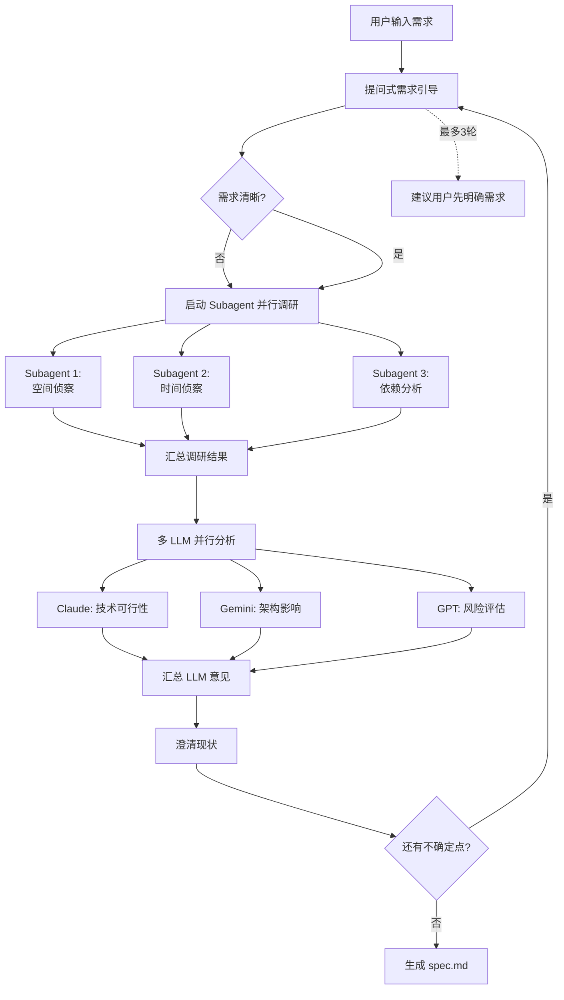
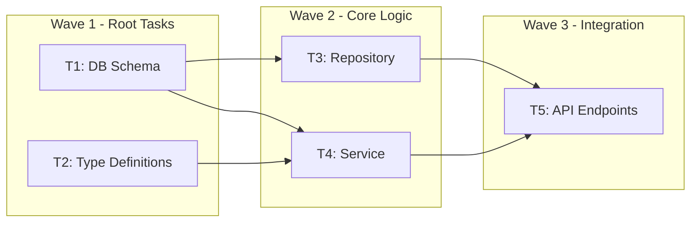
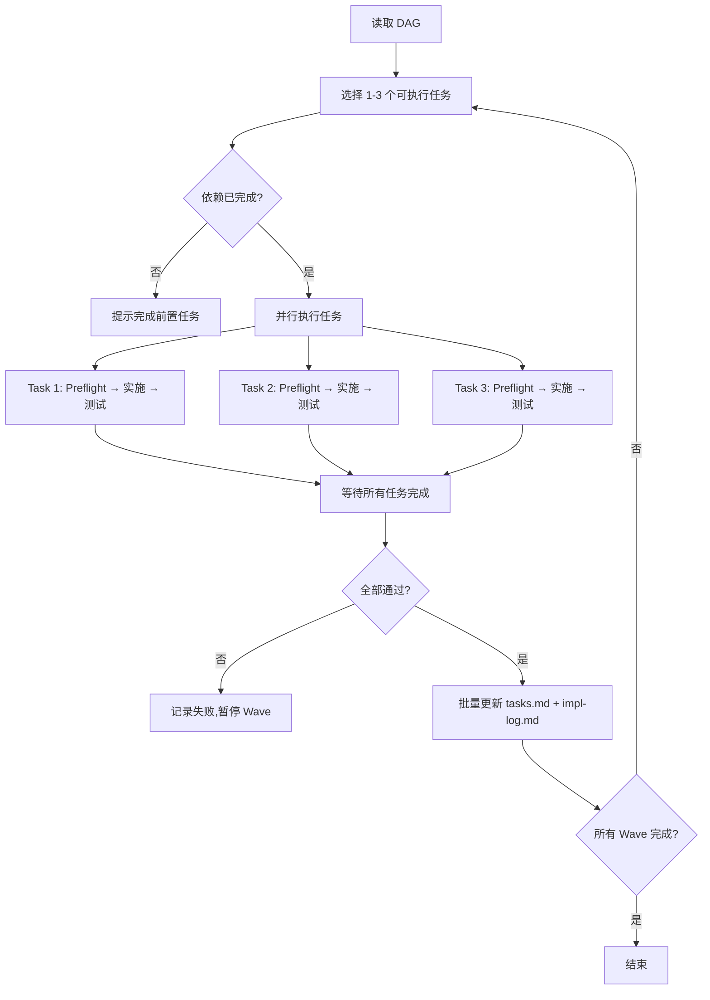
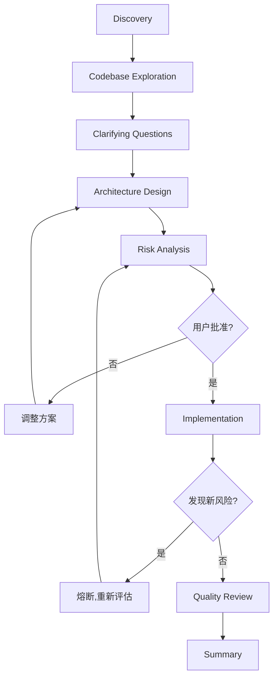

# Devkit Core Commands Refactor Plan (v3)

## 背景与目标

当前 `@plugins/devkit-core/commands/` 中存在较多命令，且多份命令在"分析/规划/执行/审查/测试/调试/优化"等流程上高度重复。

本计划的目标是：

- 用 Claude Code 的 **命令开发最佳实践**（扁平命令结构 + 前缀分组）重构命令集合。
- **废弃计划模式**：全力拥抱 **Spec 驱动开发模式**（复杂开发）和 **dev-feature 模式**（简单开发）。
- 不考虑向后兼容：旧命令整体移动到"废弃目录"用于比对审核。
- 新命令减少重复、边界清晰、可组合（单一职责），并控制顶级命令数量在 **10 个以内**。

## 关键约束（来自 Claude Code 插件开发指南）

- **命名空间子目录可能不稳定**：官方文档支持 namespacing，但存在现实不可用/不稳定的案例；因此本计划采用"扁平结构 + 前缀分组"。
- 命令文件是给 Claude 执行的指令：写法应是"指挥 Claude 做什么"，而不是"告诉用户会发生什么"。
- 每个命令必须：
  - `description` 清晰（/help 可读）
  - 有参数时提供 `argument-hint`
- **不支持文件引用机制**：命令文件内无法 include 其他文件，通用协议需直接编写在命令内部。
- **充分利用 Subagent/Task/并行化机制**：
  - 调查阶段使用 subagent 并行探索，节省主进程 token
  - Task 执行阶段根据 DAG 依赖关系并行执行（1-3 个并发）
  - 使用后台任务处理耗时操作，避免阻塞主流程
  - 多 LLM 并行分析汇总，集各家之长（需求分析、代码审查阶段）

## 核心设计理念

### 三套开发模式

| 模式 | 适用场景 | 命令前缀 | 特点 |
|------|----------|----------|------|
| **Spec 驱动开发** | 复杂需求、跨模块、需要严格文档化 | `spec-*` | Spec → Tasks → Impl 三阶段，强调文档先行，支持 DAG 并行 |
| **快速特性开发** | 简单需求、单点修改、快速迭代 | `dev-*` | Discovery → Design → Impl → Review，轻量灵活 |
| **Issue 修复工作流** | Bug 修复、问题诊断、隔离调试 | `issue-*` | 使用 worktree 隔离环境，避免干扰主开发流程 |

### 废弃的命令（移入 deprecated）

| 命令 | 废弃理由 |
|------|----------|
| `plan.md` | 计划模式废弃，规划功能整合到 `spec-analyze` |
| `frontend.md` | 单纯的前后端区分没有必要，由 `dev-feature` 内部自动识别 |
| `backend.md` | 同上 |
| `analyze.md` | 纯分析没有必要，分析一般都是为了直接实施修改或重构 |

## 方案概览

### 1) 新命令结构（前缀分组，扁平）

所有新命令仍放在 `plugins/devkit-core/commands/` 根目录（不使用子目录 namespacing）。

**总计 10 个命令**：spec 系列 4 个 + dev 系列 3 个 + issue 系列 2 个 + git 系列 1 个

---

## 🔷 `spec-*` 系列：规范驱动开发（复杂开发）

**定位**：适合复杂需求、跨模块变更、需要严格文档化追踪的开发任务。

**核心流程**：`Spec（规范）→ Tasks（任务拆解）→ Impl（逐任务实施）→ Review（审查）`

### 命令清单

| 命令 | 描述 | 典型用法 |
|------|------|----------|
| `/spec-analyze` | 需求分析，生成 spec.md（多 LLM 并行） | `/spec-analyze 实现用户认证模块` |
| `/spec-tasks` | 将 spec 拆解为任务清单（DAG 结构） | `/spec-tasks docs/specs/auth/spec.md` |
| `/spec-impl` | 按任务清单逐个实施（支持 1-3 并发） | `/spec-impl docs/specs/auth/tasks.md` |
| `/spec-review` | 审查规范或实现与规范的一致性（多 LLM 并行） | `/spec-review docs/specs/auth/` |

### `/spec-analyze`（需求分析 - 对话式引导）

**职责**：通过**对话式需求引导**，将模糊需求转化为清晰的 `./docs/specs/<slug>-<timestamp>/spec.md`

**核心流程**（循环迭代直至需求清晰）：

```
┌─────────────────────────────────────────────────────────┐
│  提问式需求引导 → 代码调研分析 → 澄清现状 → 再次引导 → ... → 最终结论  │
└─────────────────────────────────────────────────────────┘
```

1. **提问式需求引导**
   - 根据用户输入，提出关键澄清问题
   - 问题类型：边界、约束、优先级、非功能需求
   - 使用 `AskUserQuestion` 工具进行结构化提问

2. **代码调研分析（Subagent 并行）**
   - **空间侦察**：使用 `ace-tool` (Auggie Context MCP) 获取相关上下文
     - 扫描现有 API、DB Schema、核心类
     - 使用 `search_context` 等工具进行语义搜索
   - **时间侦察**：调查相关文件的历史演进（使用 `history-detective` skill）
   - **并行执行**：启动 2-3 个 subagent 并行探索不同维度
     - Subagent 1: 空间侦察（当前代码结构）
     - Subagent 2: 时间侦察（历史演进）
     - Subagent 3: 依赖分析（影响面评估）
   - **节省 token**：subagent 在后台运行，主进程等待结果汇总

3. **多 LLM 并行分析汇总**
   - 将调研结果分发给多个 LLM（Claude/Gemini/GPT）并行分析
   - 每个 LLM 从不同角度评估：
     - 技术可行性
     - 架构影响
     - 风险评估
   - 汇总各 LLM 的分析结果，集各家之长

4. **澄清现状**
   - 基于代码调研和多 LLM 分析结果，向用户澄清现状发现
   - 识别：硬性约束、历史教训、红线
   - 如发现新的不确定点，返回步骤 1 继续引导

5. **得出最终结论**
   - 当需求边界清晰、约束明确时，生成 spec.md
   - spec.md 必须包含：范围、现状、方案、验收标准

**核心原则**：
- **不做假设**：遇到不确定点必须提问
- **事实优先**：接口/字段定义以代码现状为准
- **历史否决**：若某方案曾被回滚，必须规避或提供解决手段

**输出**：`./docs/specs/<slug>-<timestamp>/spec.md`

**错误处理**：
- 若用户输入过于模糊，最多引导 3 轮，仍不清晰则建议用户先明确需求
- 若代码调研失败（如目录不存在），明确告知用户并建议检查项目结构
- 若历史调研发现冲突方案，必须暂停并与用户确认

### `/spec-tasks`（任务拆解 - DAG 并行）

**职责**：将 spec.md 拆解为**有向无环图（DAG）**结构的任务清单，支持并行开发

**核心流程**：
1. **全局分析**：识别核心实体、数据流、用户旅程
2. **层级划分**：数据层 → 核心逻辑层 → 接口/交互层
3. **DAG 依赖构建**：
   - 使用 `DependsOn: T{M}, T{N}` 标记前置依赖
   - 无依赖任务标记 `[Root]`，可并行执行
   - 确保依赖关系形成有向无环图
4. **并行分组**：按依赖关系分层，同层任务可并行

**任务清单格式（tasks.md）**：

```markdown
## 任务清单

### Wave 1: Root Tasks（可并行）
- [ ] **T1** [Root] `数据库表结构设计`
    - Goal: ...
    - Ref: Spec §2.1
    - Files: `migrations/001_create_users.sql`

- [ ] **T2** [Root] `基础类型定义`
    - Goal: ...
    - Ref: Spec §2.2
    - Files: `types/user.ts`

### Wave 2: Depends on Wave 1（可并行）
- [ ] **T3** (DependsOn: T1) `Repository 实现`
    - Goal: ...
    - Files: `repository/user.ts`

- [ ] **T4** (DependsOn: T1, T2) `Service 层实现`
    - Goal: ...
    - Files: `services/auth.ts`

### Wave 3: Integration
- [ ] **T5** (DependsOn: T3, T4) `API 端点实现`
    - Goal: ...
    - Files: `routes/auth.ts`
```

**并行开发说明**：
- "并行"指的是**逻辑上可同时进行**，而非技术上的多线程执行
- Claude 实际执行时仍是顺序的，但同 Wave 内任务无依赖，可任意顺序执行
- 开发团队可根据 Wave 分组，多人并行开发

**输出**：`./docs/specs/<slug>-<timestamp>/tasks.md`（DAG 结构）

**错误处理**：
- 若 spec.md 格式错误或缺失关键章节，列出缺失项并建议补充
- 若检测到循环依赖，报错并提示调整任务拆解
- 若任务粒度过大（单个任务涉及 5+ 文件），建议进一步拆解

### `/spec-impl`（任务实施 - DAG 并行执行）

**职责**：按 tasks.md 的 DAG 依赖顺序实施任务，**支持 1-3 个任务并发执行**

**核心流程**：
1. **读取 DAG**：解析 tasks.md，识别当前 Wave 的可执行任务
2. **并发选择**：从当前 Wave 中选择 1-3 个未完成任务
   - 优先选择无依赖冲突的任务
   - 根据任务复杂度动态调整并发数（简单任务可 3 并发，复杂任务 1-2 并发）
3. **并行执行**：使用 Task/Subagent 机制并行实施
   - Task 1: Preflight → 实施 → 自测 → 记录
   - Task 2: Preflight → 实施 → 自测 → 记录
   - Task 3: Preflight → 实施 → 自测 → 记录
4. **等待汇总**：等待所有并行任务完成，汇总结果
5. **更新状态**：批量更新 tasks.md 和 impl-log.md
6. **循环**：继续下一批任务，直到所有 Wave 完成

**并发控制**：
- **最大并发数**：1-3 个（避免超过大模型最大并发限制）
- **动态调整**：根据任务复杂度和系统负载调整
- **失败处理**：若某个任务失败，暂停该 Wave 的其他任务，等待用户决策

**实现日志格式（impl.md）**：

```markdown
# 实现日志

## T3: Repository 实现
- **状态**: ✅ 完成
- **时间**: 2026-01-29 14:30
- **文件变更**:
  - 新增: `src/repository/user.ts` (120 行)
  - 修改: `src/repository/index.ts` (+3 行)
- **关键决策**:
  - 使用 Prisma ORM 而非原生 SQL
  - 添加软删除支持
- **测试验证**:
  - 单元测试: `tests/repository/user.test.ts` ✓
  - 集成测试: 手动验证 CRUD 操作 ✓
- **遗留问题**: 无

---

## T4: Service 层实现
...
```

**核心原则**：
- **独立日志文件**：tasks.md 保持简洁，impl.md 记录详细实现
- **最小改动**：只做任务范围内的修改
- **自测强制**：涉及接口变更必须验证

**输出**：
- 更新 `tasks.md`（勾选完成状态）
- 生成/更新 `impl.md`（详细实现记录）

**错误处理**：
- 若任务依赖未完成，提示先完成前置任务
- 若实施过程中发现 spec 有误，暂停并建议修订 spec
- 若测试失败，记录失败原因并提供回滚建议

### `/spec-review`（规范审查 - 多 LLM 并行）

**职责**：审查规范完整性、实现与规范的一致性，**使用多 LLM 并行分析**

**模式**：
- 无参数：审查最近编辑的 spec
- 指定路径：审查特定规范目录

**核心流程**：
1. **收集审查材料**：spec.md、tasks.md、impl-log.md、实现代码
2. **多 LLM 并行审查**：分发给 2-3 个 LLM 并行分析
   - LLM 1: 规范完整性审查（spec.md 结构、逻辑）
   - LLM 2: 实现一致性审查（代码 vs spec）
   - LLM 3: 质量与风险审查（代码质量、潜在问题）
3. **汇总分析结果**：整合各 LLM 的审查意见
4. **生成综合报告**：包含所有发现的问题和建议

**审查清单**：
- [ ] spec.md 是否包含所有必需章节
- [ ] tasks.md 的 DAG 是否无循环依赖
- [ ] impl-log.md 中的文件变更是否与 tasks.md 对应
- [ ] 实现代码是否符合 spec 中的验收标准
- [ ] 是否有遗留问题未解决
- [ ] 代码质量、性能、安全性评估

**输出**：综合审查报告（Markdown 格式，输出到聊天）

---

## 🔶 `dev-*` 系列：快速特性开发（简单开发）

**定位**：适合简单需求、单点修改、快速迭代的开发任务。

**核心流程**：`Discovery → Exploration → Design → Implementation → Review → Summary`

### 命令清单

| 命令 | 描述 | 典型用法 |
|------|------|----------|
| `/dev-feature` | 完整特性开发流程（包含快速实施模式） | `/dev-feature 添加暗黑模式切换` |
| `/dev-review` | 代码审查（默认审查 git diff，多 LLM 并行） | `/dev-review` |
| `/dev-test` | 测试生成/补齐/运行 | `/dev-test src/auth/` |

**注意**：
- 移除了 `/dev-impl`，快速实施功能整合到 `/dev-feature` 中
- 移除了 `/dev-debug`，调试功能移至 `/issue-debug`（使用 worktree 隔离）
- 移除了 `/dev-optimize`，优化需求可通过 `/dev-feature` 或 `/spec-analyze` 处理

### `/dev-feature`（完整特性开发 + 快速实施）

**职责**：支持两种模式
- **完整模式**：Discovery → Exploration → Design → Implementation → Review
- **快速模式**：直接实施（用户已明确需求）

**模式判断**：
- 若用户需求明确、改动范围清晰 → 快速模式
- 若需求模糊、影响面不确定 → 完整模式

**完整模式关键阶段**：
1. **Discovery**：理解需求与目标边界
2. **Codebase Exploration（Subagent 并行）**：
   - 使用 `ace-tool` (Auggie Context MCP) 获取相关上下文
   - 启动 2-3 个 subagent 并行探索不同维度
   - 节省主进程 token
3. **Clarifying Questions**：集中澄清不确定点（不做假设）
4. **Architecture Design**：2-3 种实现路径 + 推荐
5. **Risk Analysis**：影响面分析 + 风险清单
6. **Implementation**：获得批准后实施
7. **Quality Review**：代码审查
8. **Summary**：交付摘要

**快速模式流程**：
1. **快速确认**：确认改动范围和风险
2. **直接实施**：立即落地代码
3. **快速验证**：运行测试或手动验证
4. **简要总结**：输出变更摘要

**核心原则**：
- 不做假设，集中询问
- 未获批准，不开始写入
- 发现新风险，立即熔断

**通用协议段（直接内嵌）**：

```markdown
## 上下文检索协议
1. 优先使用 ace-tool (Auggie Context MCP) 的 search_context 等工具
2. 若 ace-tool 不可用，使用 GrepSearch + ReadFile 组合
3. 搜索范围：优先搜索与需求相关的目录，避免全局搜索

## 风险分析协议
1. 识别影响范围：文件数量、依赖关系、API 变更
2. 评估风险等级：低（单文件）、中（多文件）、高（跨模块/API 变更）
3. 高风险变更必须获得用户明确批准

## 用户确认协议
1. 设计方案必须获得用户确认后才能实施
2. 高风险变更必须二次确认
3. 使用 AskUserQuestion 进行结构化确认
```

**错误处理**：
- 若探索阶段未找到相关代码，建议用户检查需求描述或项目结构
- 若设计阶段发现多个方案难以抉择，列出优劣对比并请用户决策
- 若实施阶段遇到意外错误，记录错误信息并建议回滚

### `/dev-review`（代码审查 - 多 LLM 并行）

**职责**：审查代码变更，**使用多 LLM 并行分析**

**模式**：
- 无参数：审查 `git diff`（未提交变更）
- 指定文件/目录：审查特定范围

**核心流程**：
1. **收集变更**：获取 git diff 或指定文件内容
2. **多 LLM 并行审查**：分发给 2-3 个 LLM 并行分析
   - LLM 1: 代码风格与规范审查
   - LLM 2: 逻辑与 bug 审查
   - LLM 3: 性能与安全审查
3. **汇总分析结果**：整合各 LLM 的审查意见
4. **生成综合报告**：包含所有发现的问题和建议

**审查维度**：
- 代码风格一致性
- 潜在 bug 或边界情况
- 性能问题
- 安全隐患
- 测试覆盖

### `/dev-test`（测试）

**职责**：测试生成、补齐、运行策略

**流程**：
1. 探测项目测试基础设施（框架、配置）
2. 决定策略（TDD / tests-after / manual-only）
3. 生成或补齐测试
4. 运行验证

**支持的测试框架**：
- Jest / Vitest（JavaScript/TypeScript）
- Pytest（Python）
- Go test（Go）
- 其他：根据项目配置自动识别

---

## � `issue-*` 系列：Issue 修复工作流（隔离调试）

**定位**：Bug 修复、问题诊断、隔离调试，**使用 worktree 技能避免干扰主开发流程**。

**核心理念**：
- 使用 git worktree 创建隔离环境
- 在独立目录中进行调试和修复
- 避免影响主开发分支的进度
- 修复完成后合并回主分支

### 命令清单

| 命令 | 描述 | 典型用法 |
|------|------|----------|
| `/issue-debug` | 调试诊断流程（worktree 隔离） | `/issue-debug #123 登录失败问题` |
| `/issue-fix` | 快速修复 issue（worktree 隔离） | `/issue-fix #456 修复按钮样式` |

### `/issue-debug`（调试诊断 - Worktree 隔离）

**职责**：在隔离环境中进行问题诊断和调试

**核心流程**：
1. **创建 Worktree**：使用 worktree skill 创建隔离环境
   - 分支命名：`issue-{issue_number}-debug`
   - 目录命名：`.worktrees/issue-{issue_number}`
2. **问题复现**：在隔离环境中尝试复现问题
3. **诊断分析（Subagent 并行）**：
   - Subagent 1: 日志分析
   - Subagent 2: 代码追踪
   - Subagent 3: 依赖检查
4. **根因定位**：汇总分析结果，定位根本原因
5. **修复建议**：提供修复方案或直接修复
6. **验证测试**：在隔离环境中验证修复
7. **清理或合并**：
   - 若修复成功：合并到主分支，清理 worktree
   - 若需要更多调查：保留 worktree，记录进度

**调试策略**：
- 优先查看错误堆栈和日志
- 使用 `ace-tool` 搜索相关代码
- 添加日志语句辅助诊断
- 提供最小复现步骤

**Worktree 管理**：
- 自动创建和清理 worktree
- 避免 worktree 泄漏（超过 7 天自动提醒清理）
- 支持多个 issue 同时调试（不同 worktree）

### `/issue-fix`（快速修复 - Worktree 隔离）

**职责**：在隔离环境中快速修复已知问题

**适用场景**：
- 问题原因已明确
- 修复范围清晰
- 需要避免干扰主开发流程

**核心流程**：
1. **创建 Worktree**：创建隔离修复环境
   - 分支命名：`issue-{issue_number}-fix`
2. **快速修复**：直接实施修复
3. **测试验证**：运行相关测试
4. **提交合并**：提交修复并合并到主分支
5. **清理 Worktree**：自动清理隔离环境

**核心原则**：
- 快速、隔离、安全
- 不影响主开发流程
- 自动化 worktree 生命周期管理

---

## 🔧 `git-*` 系列：Git 工作流

| 命令 | 描述 | 典型用法 |
|------|------|----------|
| `/git-commit` | 智能生成 Conventional Commit 并提交 | `/git-commit` |

### `/git-commit`（提交）

**职责**：生成 Conventional Commit 信息并提交

**特性**：
- 分析 staged changes 自动生成 commit message
- 遵循 Conventional Commits 规范
- 避免提交敏感文件
- 尊重 git hooks

**Commit 类型**：
- `feat`: 新功能
- `fix`: Bug 修复
- `docs`: 文档变更
- `style`: 代码格式（不影响功能）
- `refactor`: 重构
- `test`: 测试相关
- `chore`: 构建/工具变更

---

## 2) 旧命令处理

### 直接删除（不移入 deprecated）

| 命令 | 废弃理由 |
|------|----------|
| `plan.md` | 计划模式废弃 |
| `frontend.md` | 前后端区分没必要 |
| `backend.md` | 前后端区分没必要 |
| `analyze.md` | 纯分析没必要 |

### 移入 deprecated

其他旧命令统一移动到：`plugins/devkit-core/commands/deprecated/`
- 不做自动转发
- 旧命令保留原文，作为对照与审计依据

### 迁移指南

为旧命令用户提供迁移路径：

| 旧命令 | 新命令 | 说明 |
|--------|--------|------|
| `/plan <需求>` | `/spec-analyze <需求>` | 复杂需求使用 spec 驱动开发 |
| `/plan <需求>` | `/dev-feature <需求>` | 简单需求使用快速开发 |
| `/frontend <需求>` | `/dev-feature <需求>` | 自动识别前端技术栈 |
| `/backend <需求>` | `/dev-feature <需求>` | 自动识别后端技术栈 |
| `/analyze <目标>` | `/spec-analyze <目标>` | 分析后直接生成 spec |
| `/analyze <目标>` | `/dev-feature <目标>` | 分析后直接实施 |

---

## 工件输出路径

| 类型 | 路径 | 说明 |
|------|------|------|
| Spec 规范文档 | `./docs/specs/<slug>-<timestamp>/spec.md` | 需求分析产出 |
| 任务清单 | `./docs/specs/<slug>-<timestamp>/tasks.md` | DAG 结构 |
| 实现日志 | `./docs/specs/<slug>-<timestamp>/impl.md` | 详细实现记录 |

**路径设计说明**：
- 使用 `<slug>-<timestamp>` 格式支持同一需求的多次迭代
- 避免覆盖历史版本，便于对比不同方案
- `<slug>` 为需求简短标识（如 `auth`、`dark-mode`）
- `<timestamp>` 为 `YYYYMMDD-HHMMSS` 格式

---

## 典型工作流示例

### 场景 1：新功能开发（复杂 - 用户认证模块）

```bash
# 1. 需求分析
/spec-analyze 实现用户认证模块，支持邮箱密码登录和 JWT token

# 2. 审查生成的 spec.md
# 手动查看 docs/specs/auth-20260129-143000/spec.md

# 3. 任务拆解
/spec-tasks docs/specs/auth-20260129-143000/spec.md

# 4. 逐任务实施
/spec-impl docs/specs/auth-20260129-143000/tasks.md

# 5. 审查实现
/spec-review docs/specs/auth-20260129-143000/

# 6. 提交代码
/git-commit
```

### 场景 2：快速修复（简单 - 登录页面样式）

```bash
# 1. 快速实施（使用 dev-feature 快速模式）
/dev-feature 修复登录页面的按钮对齐问题，按钮应该居中显示

# 2. 审查变更
/dev-review

# 3. 提交代码
/git-commit
```

### 场景 3：Bug 调试（隔离环境 - 登录失败）

```bash
# 1. 在 worktree 中调试诊断
/issue-debug #123 用户反馈登录时提示"Invalid credentials"，但密码确认正确

# 2. 修复后测试（在 worktree 中）
/dev-test src/auth/login.ts

# 3. 审查变更
/dev-review

# 4. 提交并合并（自动清理 worktree）
/git-commit
```

### 场景 3.5：快速修复 Issue（隔离环境）

```bash
# 1. 在 worktree 中快速修复
/issue-fix #456 修复按钮样式问题

# 2. 自动测试、提交、合并、清理 worktree
```

### 场景 4：添加测试（单独）

```bash
# 1. 为现有代码补充测试
/dev-test src/services/user.ts

# 2. 审查测试代码
/dev-review tests/services/user.test.ts

# 3. 提交代码
/git-commit
```

### 场景 5：完整特性开发（中等 - 暗黑模式）

```bash
# 1. 完整开发流程
/dev-feature 添加暗黑模式切换功能，需要持久化用户偏好

# 2. 补充测试
/dev-test src/theme/

# 3. 审查变更
/dev-review

# 4. 提交代码
/git-commit
```

---

## 错误处理策略

### Spec 驱动开发错误处理

| 错误场景 | 处理策略 |
|----------|----------|
| spec.md 格式错误 | 列出缺失章节，建议补充或重新生成 |
| tasks.md 循环依赖 | 报错并提示调整任务拆解，提供建议的依赖关系 |
| 实施过程中发现 spec 有误 | 暂停实施，建议修订 spec 后重新拆解任务 |
| 测试失败 | 记录失败原因，提供回滚建议，询问是否继续 |
| 任务依赖未完成 | 提示先完成前置任务，列出依赖链 |

### 快速开发错误处理

| 错误场景 | 处理策略 |
|----------|----------|
| 需求不明确 | 建议使用 `/dev-feature` 进行完整分析 |
| 代码探索失败 | 建议用户检查项目结构或提供更多上下文 |
| 设计方案冲突 | 列出优劣对比，请用户决策 |
| 实施遇到意外错误 | 记录错误信息，提供回滚建议 |
| Git 操作失败 | 显示 git 错误信息，建议手动处理 |

### 通用错误处理原则

1. **明确报错**：清晰说明错误原因和影响范围
2. **提供建议**：给出具体的解决方案或替代方案
3. **保护现场**：错误发生时避免破坏已有代码
4. **记录日志**：在实现日志中记录错误和处理过程
5. **用户决策**：重大错误需用户确认后续操作

---

## 迁移执行步骤（TODO）

- [ ] 1. 创建备份：复制当前 commands 目录到 commands.backup
- [ ] 2. 删除废弃命令：`plan.md`、`frontend.md`、`backend.md`、`analyze.md`
- [ ] 3. 创建 deprecated 目录并移入其他旧命令
- [ ] 4. 编写 `spec-*` 系列命令（4 个）
  - [ ] 4.1 `/spec-analyze` - 需求分析（多 LLM 并行 + subagent）
  - [ ] 4.2 `/spec-tasks` - 任务拆解（DAG 结构）
  - [ ] 4.3 `/spec-impl` - 任务实施（1-3 并发执行）
  - [ ] 4.4 `/spec-review` - 规范审查（多 LLM 并行）
- [ ] 5. 编写 `dev-*` 系列命令（3 个）
  - [ ] 5.1 `/dev-feature` - 完整特性开发 + 快速实施（合并 dev-impl）
  - [ ] 5.2 `/dev-review` - 代码审查（多 LLM 并行）
  - [ ] 5.3 `/dev-test` - 测试生成/补齐/运行
- [ ] 6. 编写 `issue-*` 系列命令（2 个）
  - [ ] 6.1 `/issue-debug` - 调试诊断（worktree 隔离）
  - [ ] 6.2 `/issue-fix` - 快速修复（worktree 隔离）
- [ ] 7. 重构 `/git-commit`
- [ ] 8. 更新插件文档（README/marketplace 说明）
- [ ] 9. 创建迁移指南文档（MIGRATION.md）
- [ ] 10. 试运行验证：
  - [ ] 10.1 `/help` 中命令展示是否符合预期
  - [ ] 10.2 每个命令最少跑一次"无参数/有参数"路径
  - [ ] 10.3 验证 subagent/并行执行机制
  - [ ] 10.4 验证 worktree 隔离功能
  - [ ] 10.5 验证多 LLM 并行分析
  - [ ] 10.6 验证错误处理是否正常工作
  - [ ] 10.7 测试典型工作流场景

---

## 决策记录

### v3 变更（2026-01-29）

1. **强化 Subagent/并行执行机制**：
   - 调查阶段使用 2-3 个 subagent 并行探索，节省主进程 token
   - Task 执行阶段支持 1-3 个任务并发（基于 DAG 依赖）
   - 使用后台任务处理耗时操作
2. **引入多 LLM 并行分析**：
   - `/spec-analyze` 需求分析阶段使用多 LLM 并行评估
   - `/spec-review` 和 `/dev-review` 审查阶段使用多 LLM 并行分析
   - 汇总各 LLM 意见，集各家之长
3. **使用 ace-tool 替代 CodeSearch**：
   - 优先使用 `ace-tool` (Auggie Context MCP) 的 `search_context` 等工具
   - 若不可用则降级到 GrepSearch + ReadFile
4. **新增 issue-* 系列**：
   - `/issue-debug` 和 `/issue-fix` 使用 worktree 隔离环境
   - 避免调试过程干扰主开发流程
   - 自动管理 worktree 生命周期
5. **简化 dev 系列**：
   - 移除 `/dev-impl`，快速实施功能整合到 `/dev-feature`
   - 移除 `/dev-debug`，调试功能移至 `/issue-debug`
   - dev 系列从 5 个减少到 3 个
6. **移除 AllowedTools 说明**：待明确 Claude 提供的工具清单后再补充
7. **命令数量调整**：spec 4 + dev 3 + issue 2 + git 1 = **10 个命令**

### v2 变更（2026-01-29）

1. **移除 `_partials` 引用机制**：Claude Code 不支持文件引用，改为在命令内直接编写通用协议段
2. **移除智能路由命令**：删除 `/spec` 和 `/dev` 路由入口，用户直接使用功能命令更明确
3. **移除 `/dev-optimize`**：优化需求可通过 `/dev-feature` 或 `/spec-analyze` 处理，减少命令数量
4. **修改实现记录方式**：从"原地备注"改为独立的 `impl-log.md`，提高可读性和可维护性
5. **优化工件路径**：使用 `<slug>-<timestamp>` 格式支持多次迭代
6. **补充错误处理策略**：为每个命令系列添加详细的错误处理说明
7. **添加典型工作流示例**：提供 5 个实际使用场景
8. **添加迁移指南**：为旧命令用户提供明确的迁移路径

### v1 决策（保留）

- **废弃计划模式**：全力拥抱 Spec 驱动开发和 dev-feature 快速开发。
- **删除命令**：`plan.md`、`frontend.md`、`backend.md`、`analyze.md` 直接删除。
- **命令组织**：采用"扁平结构 + 前缀分组（spec-* / dev-* / issue-* / git-*）"。
- **顶级命令数量**：目标 10 个。
- **命名风格**：统一使用 `/spec-*`、`/dev-*`、`/issue-*`、`/git-*` 格式。

---

## 命名规范总结

### 命令命名

| 系列 | 命令 |
|------|------|
| **spec 系列** | `/spec-analyze`、`/spec-tasks`、`/spec-impl`、`/spec-review` |
| **dev 系列** | `/dev-feature`、`/dev-review`、`/dev-test` |
| **issue 系列** | `/issue-debug`、`/issue-fix` |
| **git 系列** | `/git-commit` |

### 文件命名

| 类型 | 命名格式 | 示例 |
|------|----------|------|
| 命令文件 | `<prefix>-<action>.md` | `spec-analyze.md` |
| Spec 目录 | `<slug>-<timestamp>` | `auth-20260129-143000` |
| Spec 文档 | `spec.md` | `docs/specs/auth-20260129-143000/spec.md` |
| 任务清单 | `tasks.md` | `docs/specs/auth-20260129-143000/tasks.md` |
| 实现日志 | `impl.md` | `docs/specs/auth-20260129-143000/impl.md` |

---

## 流程图

### 开发模式选择

```mermaid
flowchart TD
    A[用户需求] --> B{需求类型?}
    B -->|复杂/跨模块/需文档化| C[Spec 驱动开发]
    B -->|简单/单点修改/快速迭代| D[快速特性开发]
    B -->|Bug修复/问题诊断| E[Issue 修复工作流]

    C --> C1[/spec-analyze<br/>多LLM并行分析]
    C1 --> C2[/spec-tasks<br/>DAG拆解]
    C2 --> C3[/spec-impl<br/>1-3并发执行]
    C3 --> C4[/spec-review<br/>多LLM并行审查]

    D --> D1{需求明确度?}
    D1 -->|明确| D2[/dev-feature<br/>快速模式]
    D1 -->|需探索| D3[/dev-feature<br/>完整模式]
    D2 --> D4[/dev-review]
    D3 --> D4

    E --> E1{问题复杂度?}
    E1 -->|需诊断| E2[/issue-debug<br/>worktree隔离]
    E1 -->|已知修复| E3[/issue-fix<br/>worktree隔离]
```

### Spec-Analyze 对话式引导流程（含 Subagent 并行）



### Spec-Tasks DAG 并行拆解



### Spec-Impl 任务实施流程（1-3 并发）



### Dev-Feature 完整流程



---

## 总结

本 v3 计划相比 v2 的主要改进：

1. ✅ **Subagent/并行执行**：调查阶段 2-3 个 subagent 并行，Task 执行 1-3 并发
2. ✅ **多 LLM 分析**：需求分析和审查阶段使用多 LLM 并行，集各家之长
3. ✅ **ace-tool 集成**：使用 Auggie Context MCP 的 search_context 等工具
4. ✅ **Worktree 隔离**：新增 issue-* 系列，调试不干扰主开发流程
5. ✅ **命令精简**：dev 系列从 5 个减少到 3 个，总计 10 个命令
6. ✅ **技术可行性**：所有设计基于 Claude Code 实际能力

下一步：按照"迁移执行步骤"逐步实施重构。
