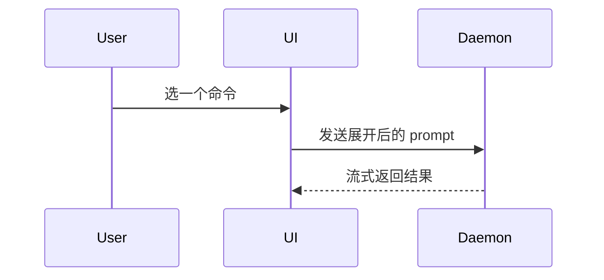

# Show Me（把当前话题画给用户看）

略过铺垫，散文压到最短。挑**最小**那种能把要点讲清楚的视图——多给一种就多一份要读者自己对齐的东西。

## 选哪一种

按「要讲的是什么」选，不按「哪种看起来更专业」选。

### 讲逻辑或算法 → 伪代码

```text
on(save)
  若内容未变
    返回缓存结果
  写入新内容
  返回新结果
```

### 讲运行时控制流 → 调用树

```text
submitForm
  createSession
    persistPrompt
    launchAgent
  navigateToSession
```

### 讲 UI 结构 → 组件树

带上真正相关的 state 与模块边界，其余一律不写。

```tsx
<SessionPage> (apps/example/src/routes/session.tsx)
  useSessionEvents()
  <SessionToolbar>
    <RunSkillButton> (packages/ui)
```

### 讲文件职责或一次大范围重构 → 浅文件树

只铺到能说明职责的那一层，不要把整棵树倒出来。

```text
plugins/devkit-tool/
├── hooks/          # 纯注入，不拦操作
├── skills/         # 一个技能一个目录
└── tests/          # 离线回归用例
```

### 讲组件交互、控制流或数据流 → Mermaid



### 讲「变了什么」→ diff

前提是周围那个形状已经存在、读者已经知道。**diff 的形状要跟话题的形状对齐**——讲组件改动就 diff 组件树，讲目录调整就 diff 文件树，不要一律 diff 源码。

组件改动：

```diff
 <SessionPage>
   useSessionEvents()
   <SessionToolbar>
+    <RunSkillButton />
   <SessionTimeline>
+    <SkillResultCard />
```

文件布局改动：

```diff
 src/
 ├── commands/
+│   └── show-me.ts       # 展开这条 slash command
 ├── sessions/
-└── transport.ts
+└── transport/
+    ├── client.ts
+    └── stream.ts
```

调用树／调用栈改动：

```diff
 submitForm
   createSession
     persistPrompt
+    expandSkillMention
     launchAgent
-  navigateToSession
+  navigateToSession
+    subscribeToEvents
```

状态或控制流改动：

```diff
 on(save)
-  写入内容
+  若内容未变
+    返回缓存结果
+  写入新内容
+  失效缓存
```

### 讲一段大部分是新写的东西 → 整块贴出来

三种情况值得贴整块：大半是新的；省掉上下文会让归属或先后顺序看不出来；用户需要一份可直接复制的目标形状。

```ts
function expandSkill(command: string): string {
  const skillName = command.slice(1)
  return `use the ${skillName} skill`
}
```

### 讲视觉界面、布局、状态对比，或 Mermaid 装不下的概念 → 一个 HTML 文件

图解、信息图、短幻灯，哪种贴合要点就做哪种。配色、字体、间距、组件向目标产品看齐，用真实标签与真实数据（不要 Lorem），桌面与移动都能看。

落点固定在系统临时目录，**不要写进仓库**——它是一次性给人看的产物，留在工作区会弄脏 `git status`，还可能被顺手提交进去：

```
Bash(open /tmp/show-me-<短描述>.html)
```

**这一条只有主会话在 Human 在场时执行。** 子代理不要 `open`——它会抢走屏幕焦点，而子代理并不知道 Human 此刻在不在看。子代理把生成好的 HTML 绝对路径写进回执，由主会话决定什么时候打开。

## 排版约定

- **视图紧挨着它支撑的那一两句话**，不要把图攒到回答末尾。读者是在读到那句话时需要那张图的。
- **代码块内部的路径原样写裸路径**（`plugins/devkit-tool/skills/show-me/SKILL.md`），不要套 markdown 链接——终端不会把块里的链接渲染成可点击，反而把树形结构撑乱。正文里提到某个文件时才按会话的 clickable-paths 约定给链接，两者互不冲突。
- **只保留回答当前问题所需的那些调用、文件、props、状态与边界。** 判据是：删掉这一行，用户还能不能答出他正在纠结的那个问题；能，就删掉。

## 什么时候不触发

- **用户问的是一个事实**（某个值是多少、某条命令怎么写、某个报错什么意思）——直接答，画图是绕路。
- **要讲的东西没有形状**（一句话的取舍、一个是非判断、一段状态汇报）——散文更短。
- **形状已经在用户眼前**——他刚贴出那段代码、刚看过那个目录树，再画一遍是复述。
- **用户当轮明确说了不要图**——以他的话为准。

## 收尾

上面这些形态，一次通常用一种，偶尔两种，几乎不会全用上。自己判断，别把用户淹了。
